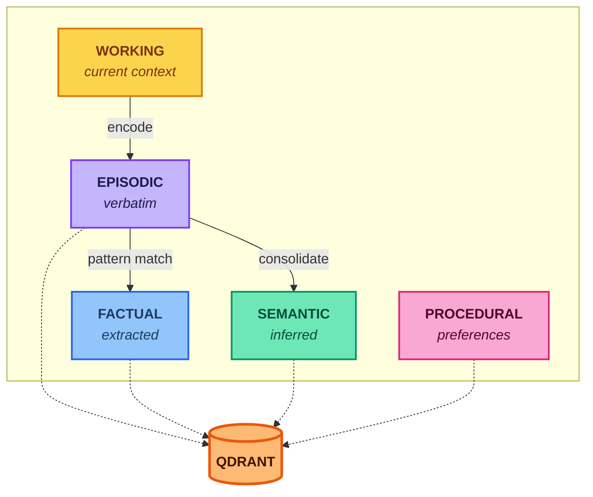

# Engram

A memory system for AI applications, inspired by cognitive science.

## The Problem

AI applications need to remember things across conversations. Common approaches have tradeoffs:

| Approach | Tradeoff |
|----------|----------|
| **Stuff it in the prompt** | Hits token limits. Gets expensive and slow. |
| **Summarize old conversations** | Loses important details. Can't recall specifics. |
| **Store everything in a vector database** | Never forgets anything. Retrieves irrelevant noise over time. |
| **LLM extraction on every message** | Compounds extraction errors. Loses source data. |

The fundamental issue: these approaches don't distinguish between types of information or track where knowledge came from.

## Approach

Engram uses a few key ideas:

1. **Multiple memory types** — Different information needs different handling. A user's email address is not the same as an inferred preference.

2. **Preserve ground truth** — Raw conversations are stored verbatim. Everything else is derived and can be rebuilt if needed.

3. **Track confidence** — Know what's certain (direct quotes) vs. uncertain (inferences).

4. **Forget intelligently** — Old, unimportant memories fade. Important memories persist.

5. **Defer expensive work** — Don't run LLM extraction on every message. Batch it. Keep the fast path fast.

## Memory Types

Engram maintains six types of memory:



| Type | What It Stores | Example | How It's Created |
|------|---------------|---------|------------------|
| **Working** | Current conversation context | Active task, recent messages | Automatic |
| **Episodic** | Raw conversations, verbatim | "User asked about Python async on Tuesday" | Stored immediately |
| **Factual** | Explicit facts, high confidence | `email: john@example.com` | Pattern extraction (no LLM) |
| **Semantic** | Inferred knowledge, uncertain | "User is experienced with databases" | LLM consolidation (background) |
| **Procedural** | Learned behaviors | "User prefers concise responses" | Pattern detection over time |
| **Scratchpad** | Agent execution state | File paths, variables, task progress | Explicit storage |

## Key Design Decisions

### Ground Truth is Sacred

Every derived memory points back to source episodes. If extraction makes a mistake, you can re-derive from the original. Nothing is lost.

### Confidence is Explicit

Every memory carries a confidence score and source type:
- `verbatim` — Direct quote, 100% confidence
- `extracted` — Pattern-matched fact, high confidence
- `inferred` — LLM-derived, variable confidence

Retrieval can filter by confidence: "Give me only facts I can trust."

### Forgetting is a Feature

Memories decay over time following the [Ebbinghaus forgetting curve](research/ebbinghaus-forgetting-curve.md):
- Unimportant memories fade quickly
- Accessed memories get reinforced
- High-importance memories persist indefinitely

This keeps the memory store relevant and fast.

### Fast Path Stays Fast

Expensive LLM work happens in the background:

| Operation | When | Cost |
|-----------|------|------|
| Store episode | Every message | Low (embed + store) |
| Extract facts | Every message | Low (regex, no LLM) |
| Infer semantics | Background job | Medium (LLM, batched) |
| Consolidate | Scheduled | Medium (LLM, batched) |
| Decay | Scheduled | Low (math only) |

## Usage

```python
from engram import MemoryStore

memory = MemoryStore(qdrant_url="...", user_id="user_123")

# Store an interaction (immediate, cheap)
await memory.encode(interaction, extract_facts=True)

# Retrieve relevant memories
memories = await memory.recall(
    query="What databases does the user work with?",
    memory_types=["factual", "semantic"],
    min_confidence=0.7
)

# Background: consolidate episodes into semantic knowledge
await memory.consolidate()

# Background: apply forgetting curves
await memory.decay()
```

## Research Foundations

Engram is inspired by cognitive science research. We use these theories as design inspiration, not strict implementation targets. See [research/overview.md](research/overview.md) for:

- Theoretical foundations (Atkinson-Shiffrin, Tulving, Ebbinghaus, etc.)
- How Engram maps to cognitive science
- Known limitations of these models
- Why we use them anyway

| Principle | Research | Application |
|-----------|----------|-------------|
| Separate memory systems | Atkinson-Shiffrin (1968) | Different memory types |
| Episodic vs semantic | Tulving (1972) | Events consolidate into facts |
| Forgetting curves | Ebbinghaus (1885) | Exponential decay based on importance |
| Deep processing | Craik & Lockhart (1972) | Extract meaning, not just store text |
| Retrieval strengthens | Spaced repetition research | Accessed memories persist longer |

## Documentation

- [Architecture](docs/architecture.md) — Memory types, data flow, storage design
- [Related Work](docs/related-work.md) — LLM memory systems, cognitive science updates

## Status

Pre-alpha. Architecture and design phase.

## License

MIT
