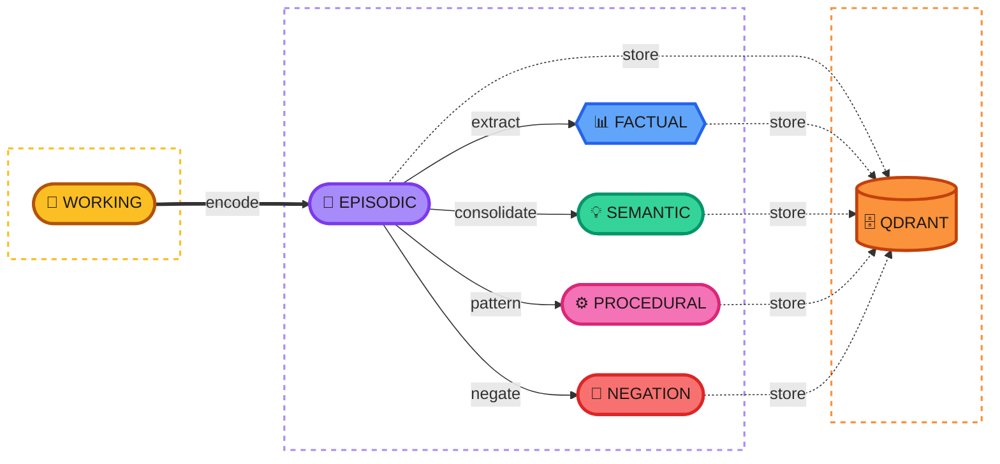

<p align="center">
  
</p>

# Engram

**Memory you can trust.**

A memory system for AI applications that preserves ground truth, tracks confidence, and prevents hallucinations.

## The Problem

AI memory systems have an accuracy crisis. Recent benchmarks show:

> "All systems achieve answer accuracies below 56%, with hallucination rate and omission rate remaining high... Systems suffer omission rates above 50%."
>
> — [HaluMem: Hallucinations in LLM Memory Systems](https://arxiv.org/html/2511.03506)

Why? Most systems use LLM extraction on every message. This compounds errors:

| Approach | What Goes Wrong |
|----------|----------------|
| **Summarize conversations** | Loses details. Can't recall specifics. |
| **LLM extraction on write** | Extraction errors become permanent. Hallucinations propagate. |
| **Store in vector DB only** | No structure. Retrieves irrelevant noise. |

The fundamental issue: once source data is lost, errors cannot be corrected.

## The Solution

Engram preserves ground truth and tracks confidence:

1. **Store first, derive later** — Raw conversations stored verbatim. LLM extraction happens in background where errors can be caught.

2. **Track confidence** — Every fact carries a composite confidence score: extraction method + corroboration + recency + verification. Fully auditable.

3. **Verify on retrieval** — Applications filter by confidence. High-stakes queries use only trusted facts.

4. **Enable recovery** — Derived facts trace to sources. Errors can be corrected by re-deriving.

## How Trust Works

```
User: "My email is john@example.com"
    ↓
Episodic Memory (immutable, verbatim)
    ↓
Factual Memory: email=john@example.com
├── Source: Episode #1234
├── Extraction: pattern match (deterministic)
└── Confidence: 0.9

Later query: "What's the user's email?"
    ↓
Retrieval with min_confidence=0.9
    ↓
Returns: john@example.com (verified against source)
```

## Memory Types



| Type | Confidence | Source | Use Case |
|------|------------|--------|----------|
| **Working** | N/A | Current context | Active conversation (in-memory, volatile) |
| **Episodic** | Highest | Verbatim storage | Ground truth, audit trail |
| **Factual** | High | Pattern extraction | Emails, dates, names |
| **Semantic** | Variable | LLM inference | Preferences, context |
| **Procedural** | Variable | LLM inference | Behavioral preferences |
| **Negation** | Variable | Negation detection | What is NOT true |

## Hierarchical Memory Consolidation

Engram implements **hierarchical compression** based on cognitive science research ([Complementary Learning Systems](https://www.sciencedirect.com/science/article/pii/S1364661318302821)):

```
EPISODIC (raw, immutable, automatic)
    │
    ├──→ FACTS/NEGATIONS (pattern-extracted, high confidence)
    │
    └──→ SEMANTIC (LLM summary of N episodes → 1 memory)
              │
              └──→ PROCEDURAL (LLM synthesis → behavioral patterns)
```

### The Compression Pipeline

| Stage | Input | Output | Compression |
|-------|-------|--------|-------------|
| **Encode** | 1 message | 1 episode + N facts | None (ground truth) |
| **Consolidate** | N episodes | 1 semantic summary | N:1 |
| **Synthesize** | All semantics | 1 procedural memory | ∞:1 |

### Bidirectional Traceability

Every derived memory links back to its sources:

```python
# Semantic memory → source episodes
semantic.source_episode_ids  # ["ep_001", "ep_002", "ep_003"]

# Episode → semantic memory it was summarized into
episode.summarized_into  # "sem_abc123"

# Procedural memory → source semantics
procedural.source_semantic_ids  # ["sem_001", "sem_002"]
```

This enables full audit trails: any insight can be traced back to the original conversation.

### Why Compression Matters

| Without Compression | With Compression |
|---------------------|------------------|
| 1000 episodes = 1000 searches | 1000 episodes → 50 summaries |
| Retrieval finds noise | Retrieval finds distilled knowledge |
| Token cost grows linearly | Token cost stays bounded |
| No cross-session patterns | Procedural captures behavior |

## Semantic Search Everywhere

**Every memory type is semantically searchable.** When you store or extract anything, Engram:

1. **Embeds it** — Converts text to a vector representation
2. **Stores in Qdrant** — Vector database enables similarity search
3. **Searches semantically** — Query "contact info" finds emails, phones, addresses

```
User: "My email is user@example.com"
                ↓
┌─────────────────────────────────────────────────────────────┐
│  Episode                                                    │
│  ├── content: "My email is user@example.com"               │
│  └── embedding: [0.12, -0.34, 0.56, ...]  ← semantic search │
└─────────────────────────────────────────────────────────────┘
                ↓ pattern extraction
┌─────────────────────────────────────────────────────────────┐
│  Fact                                                       │
│  ├── content: "user@example.com"                           │
│  ├── category: "email"                                      │
│  └── embedding: [0.23, -0.45, 0.67, ...]  ← semantic search │
└─────────────────────────────────────────────────────────────┘
                ↓ consolidation (LLM)
┌─────────────────────────────────────────────────────────────┐
│  SemanticMemory                                             │
│  ├── content: "User's primary email is user@example.com"   │
│  └── embedding: [0.34, -0.56, 0.78, ...]  ← semantic search │
└─────────────────────────────────────────────────────────────┘
```

**The semantic layer is end-to-end:**

| Stage | What happens | Semantic capability |
|-------|--------------|---------------------|
| **Encode** | Episode embedded | "contact" finds "my email is..." |
| **Extract** | Facts embedded | "email" finds "user@example.com" |
| **Consolidate** | Semantic memories embedded | "communication preferences" finds derived insights |
| **Recall** | Query embedded, similarity search | Natural language queries work |

**Pattern extraction is an optimization, not a limitation.** Deterministic extractors (emails, phones, dates) provide high-confidence facts quickly. The embedding layer makes everything semantically discoverable regardless of extraction method.

```python
# These all work via semantic similarity:
await engram.recall("contact information", user_id="u1")  # Finds emails, phones
await engram.recall("how to reach the user", user_id="u1")  # Same results
await engram.recall("user@example.com", user_id="u1")  # Exact match also works
```

## Preventing Hallucinations

### 1. Deterministic Extraction First

Pattern matching before LLMs — no hallucination possible:

```python
# High confidence, reproducible
EMAIL_PATTERN = r'\b[\w.-]+@[\w.-]+\.\w+\b'
facts = extract_patterns(message, [EMAIL_PATTERN])
```

### 2. Defer LLM Work

Batch in background where errors can be caught:

```python
# Critical path: store ground truth + extract patterns
result = await engram.encode(content, role="user", user_id="u1")  # Fast, no LLM
# Facts extracted immediately via regex (emails, phones, dates)

# Background: derive semantics with oversight (coming soon)
# await engram.consolidate()  # LLM extraction, batched
```

### 3. Confidence-Gated Retrieval

Applications choose their trust level:

```python
# High-stakes: only verified facts
trusted = await engram.recall(query, user_id="u1", min_confidence=0.9)

# Exploratory: include inferences
all_relevant = await engram.recall(query, user_id="u1", min_confidence=0.5)
```

### 4. Source Verification

Trace any fact back to its source:

```python
# Debug: why does the system believe this?
result = await engram.verify("fact_abc123", user_id="u1")
print(result.explanation)
# → "Pattern-matched email from source episode(s). Source: ep_xyz (2024-01-15 10:30). Confidence: 0.90"

# Get raw source episodes
episodes = await engram.get_sources("fact_abc123", user_id="u1")
# → Returns original conversation where email was mentioned
```

## Usage

```python
from engram.service import EngramService

# Initialize with async context manager
async with EngramService.create() as engram:
    # Store interaction (immediate, preserves ground truth)
    result = await engram.encode(
        content="My email is john@example.com",
        role="user",
        user_id="user_123",
    )
    print(f"Stored episode {result.episode.id}")
    print(f"Extracted {len(result.facts)} facts")

    # Retrieve with confidence filtering
    memories = await engram.recall(
        query="What's the user's email?",
        user_id="user_123",
        memory_types=["factual", "semantic"],
        min_confidence=0.7,
    )

    # Verify a specific fact
    if memories:
        verified = await engram.verify(memories[0].memory_id, user_id="user_123")
        print(verified.explanation)
```

See [examples/](examples/) for working demos of consolidation, procedural synthesis, and advanced features.

## Design Principles

### Ground Truth is Sacred

Every derived memory points back to source episodes. If extraction makes a mistake, re-derive from the original.

### Confidence is Composite and Auditable

Confidence isn't a single number — it's a composite score you can explain:

| Factor | Weight | Example |
|--------|--------|---------|
| Extraction method | 50% | Pattern-matched = 0.9, LLM-inferred = 0.6 |
| Corroboration | 25% | 5 supporting episodes > 1 episode |
| Recency | 15% | Confirmed yesterday > confirmed last year |
| Verification | 10% | Email format valid, date in range |

Every score is auditable: *"0.73 because: extracted (0.9 base), 3 sources, last confirmed 2 months ago."*

### Memories Get Smarter Over Time

Engram isn't just storage—it's a system that learns:

- **Frequently-used memories strengthen** — Every time a memory participates in consolidation or gets linked to new information, it gets stronger. Based on the [Testing Effect](https://www.sciencedirect.com/topics/psychology/testing-effect), one of the most robust findings in memory research.

- **Related memories find each other** — When you say "prefer Python for scripts," that automatically links to "using Python at work." No manual organization needed.

- **Irrelevant stuff fades away** — Memories decay over time. Unimportant memories fade; important ones persist. This keeps the store relevant.

- **Retrieval suppresses competitors** — Based on [Anderson et al. (1994)](https://pubmed.ncbi.nlm.nih.gov/7931095/), when memories are retrieved, similar non-retrieved memories are suppressed. Enable with `rif_enabled=True` on recall to naturally prune redundant memories.

### Fast Path Stays Fast

| Operation | When | Cost |
|-----------|------|------|
| Store episode | Every message | Low (embed + store) |
| Extract facts | Every message | Low (regex, no LLM) |
| Infer semantics | Background | Medium (LLM, batched) |

## Documentation

- [Architecture](docs/architecture.md) — Memory types, data flow, storage
- [Development Guide](docs/development.md) — Setup, configuration, workflow
- [Research Foundations](docs/research/overview.md) — Theoretical basis and the accuracy problem
- [Competitive Analysis](docs/research/competitive.md) — How Engram compares to alternatives

## Status

Pre-alpha. Architecture and design phase.

## License

MIT
