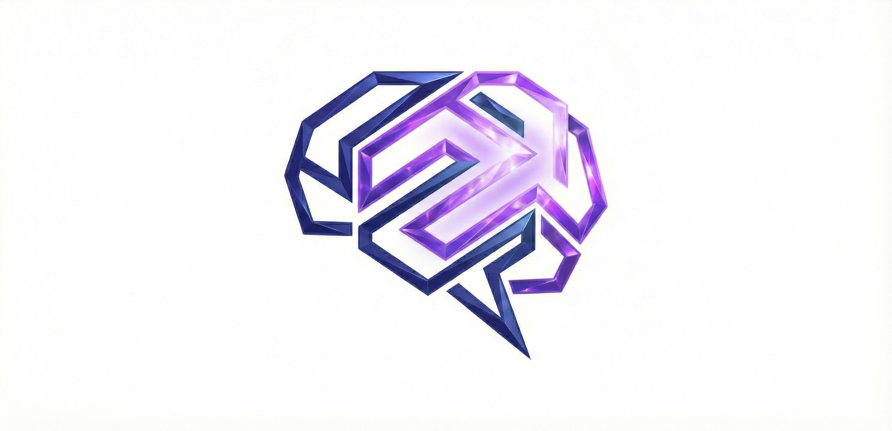

<p align="center">
  
</p>

# Engram

**Memory you can trust.**

A memory system for AI applications that preserves ground truth, tracks confidence, and prevents hallucinations.

## The Problem

AI memory systems have an accuracy crisis:

> "All systems achieve answer accuracies below 70%, with hallucination rate and omission rate remaining high."
>
> — [HaluMem: Hallucinations in LLM Memory Systems](https://arxiv.org/abs/2511.03506)

**Why?** Existing systems (Mem0, basic RAG, LangChain memory) lose source data after LLM extraction. When extraction errors occur, there's no recovery path. The original truth is gone.

## How Engram Is Different

| Traditional Memory | Engram |
|-------------------|--------|
| Embed immediately, discard source | **Store verbatim first**, derive later |
| Single similarity score | **Composite confidence** (extraction + corroboration + recency + verification) |
| No error recovery | **Re-derive from source** when errors occur |
| Flat retrieval (top-K) | **Multi-hop reasoning** via bidirectional links |
| No contradiction handling | **Negation tracking** filters outdated facts |
| No auditability | **Full provenance** — trace any memory to source |

## Key Differentiators

### 1. Ground Truth Preservation

Episodes (raw interactions) are **immutable**. All derived memories maintain `source_episode_ids` for traceability. If extraction errors occur, re-derive from source — the truth is never lost.

```python
# Every derived memory traces back to ground truth
verified = await engram.verify(memory_id, user_id="user_123")
print(verified.source_episodes)  # Original verbatim content
print(verified.explanation)      # How confidence was calculated
```

### 2. Auditable Confidence Scoring

Confidence is **not** just cosine similarity. It's a composite score you can explain:

```
Confidence: 0.73
├── Extraction method: 0.9 (regex pattern match)
├── Corroboration: 0.6 (3 supporting sources)
├── Recency: 0.8 (confirmed 2 months ago)
└── Verification: 1.0 (format validated)
```

Filter by confidence for high-stakes queries: `min_confidence=0.8`

### 3. Deferred Consolidation

Fast writes, smart background processing:

```
Encode (immediate, <100ms):
  User input → Episode (verbatim) + StructuredMemory (regex extraction)

Consolidate (background):
  N Episodes → LLM synthesis → SemanticMemory (with links to similar memories)
```

**Benefits:** Low latency, batched LLM costs, error recovery possible.

### 4. A-MEM Style Multi-Hop Reasoning

Memories link to related memories bidirectionally ([A-MEM research](https://arxiv.org/abs/2502.12110) shows 2x improvement on multi-hop benchmarks):

```python
# Follow links for deeper context
results = await engram.recall(
    query="What database?",
    user_id="user_123",
    follow_links=True,  # Traverse related memories
    max_hops=2,
)
```

### 5. Negation-Aware Retrieval

Tracks what **isn't** true to prevent returning outdated information:

```
Episode 1: "I use MongoDB"     → preference: MongoDB
Episode 2: "Switched to Redis" → preference: Redis, negation: "no longer uses MongoDB"

Query: "What database?"
Result: Redis (MongoDB filtered by negation)
```

### 6. Consolidation Strength (Testing Effect)

Memories strengthen through retrieval ([Roediger & Karpicke, 2006](https://pubmed.ncbi.nlm.nih.gov/26151629/): tested group forgot only 13% vs 52% for study-only):

```python
# Memories used more often become more stable
memory.consolidation_strength  # 0.0-1.0, increases with use
memory.consolidation_passes    # How many times refined
```

## Quick Start

### Installation

```bash
git clone https://github.com/ashita-ai/engram.git
cd engram
uv sync --extra dev

# Start Qdrant (vector database)
docker run -p 6333:6333 qdrant/qdrant
```

### Python SDK

```python
from engram.service import EngramService

async with EngramService.create() as engram:
    # Store interaction (immediate, preserves ground truth)
    result = await engram.encode(
        content="My email is john@example.com and I prefer PostgreSQL",
        role="user",
        user_id="user_123",
    )
    print(f"Episode: {result.episode.id}")
    print(f"Emails: {result.structured.emails}")  # ["john@example.com"]

    # Retrieve with confidence filtering
    memories = await engram.recall(
        query="What's the user's email?",
        user_id="user_123",
        min_confidence=0.7,
    )

    # Verify any memory back to source
    verified = await engram.verify(memories[0].memory_id, user_id="user_123")
    print(verified.explanation)

    # Run consolidation (N episodes → semantic memory)
    await engram.consolidate(user_id="user_123")
```

### REST API

```bash
# Start the server
uv run uvicorn engram.api.app:app --port 8000

# Encode a memory
curl -X POST http://localhost:8000/api/v1/encode \
  -H "Content-Type: application/json" \
  -d '{"content": "My email is john@example.com", "role": "user", "user_id": "user_123"}'

# Recall memories
curl -X POST http://localhost:8000/api/v1/recall \
  -H "Content-Type: application/json" \
  -d '{"query": "email", "user_id": "user_123", "min_confidence": 0.7}'
```

## Memory Architecture

```
┌─────────────────────────────────────────────────────────────────────┐
│                     ENCODE (Fast Path, <100ms)                       │
│  Input → Episode (verbatim, immutable)                              │
│       → StructuredMemory (regex: emails, phones, URLs)              │
└─────────────────────────────────────────────────────────────────────┘
                                ↓
┌─────────────────────────────────────────────────────────────────────┐
│                  CONSOLIDATE (Background, Deferred)                  │
│  N Episodes → LLM synthesis → SemanticMemory                        │
│            → Link to similar memories (bidirectional)               │
│            → Strengthen linked memories (Testing Effect)            │
└─────────────────────────────────────────────────────────────────────┘
                                ↓
┌─────────────────────────────────────────────────────────────────────┐
│                   RECALL (Multi-Signal Reranking)                    │
│  Query → Vector search (all types)                                  │
│       → Negation filtering (remove contradicted)                    │
│       → Confidence reranking (5 signals)                            │
│       → Multi-hop traversal (follow links)                          │
└─────────────────────────────────────────────────────────────────────┘
```

### Memory Types

| Type | Confidence | Purpose |
|------|------------|---------|
| **Episode** | 1.0 (verbatim) | Ground truth, immutable raw interactions |
| **Structured** | 0.9 (regex) / 0.8 (LLM) | Per-episode extraction (emails, phones, negations) |
| **Semantic** | Variable (0.6 base) | Cross-episode synthesis, LLM-consolidated |
| **Procedural** | Variable (0.6 base) | Behavioral patterns, long-term preferences |

## Comparison with Alternatives

| Feature | Engram | Mem0 | Zep/Graphiti | LangChain |
|---------|--------|------|--------------|-----------|
| Ground truth preservation | ✅ Immutable episodes | ❌ Lost after extraction | ✅ Episode subgraph | ❌ |
| Confidence tracking | ✅ Composite + auditable | ❌ | ❌ | ❌ |
| Error recovery | ✅ Re-derive from source | ❌ Permanent errors | ⚠️ Partial | ❌ |
| Multi-hop reasoning | ✅ Bidirectional links | ✅ Graph | ✅ Graph | ⚠️ |
| Negation handling | ✅ Explicit filtering | ❌ | ❌ | ❌ |
| Consolidation strength | ✅ Testing Effect | ❌ | ❌ | ❌ |

**When to use Engram:** High-stakes applications requiring accuracy, auditability, and ground truth preservation (healthcare, legal, finance, enterprise assistants).

**When to use alternatives:** Rapid prototyping (LangChain), managed service needs (Mem0), temporal graph queries (Zep).

## API Reference

### Core Endpoints

| Method | Endpoint | Description |
|--------|----------|-------------|
| `POST` | `/encode` | Store memory, extract structured data |
| `POST` | `/encode/batch` | Bulk import (up to 100 items) |
| `POST` | `/recall` | Semantic search with confidence filtering |
| `GET` | `/memories/{id}/verify` | Trace memory to source with explanation |
| `GET` | `/memories/{id}/provenance` | Full derivation chain |

### Workflow Endpoints

| Method | Endpoint | Description |
|--------|----------|-------------|
| `POST` | `/workflows/consolidate` | N episodes → semantic memory |
| `POST` | `/workflows/structure` | LLM enrichment for episode |
| `POST` | `/workflows/promote` | Semantic → procedural synthesis |
| `POST` | `/workflows/decay` | Apply confidence decay |

See [docs/api.md](docs/api.md) for complete reference.

## Confidence Formula

```python
confidence = (
    extraction_method * 0.50 +  # VERBATIM=1.0, EXTRACTED=0.9, INFERRED=0.6
    corroboration * 0.25 +      # log scale: 1 source=0.5, 10 sources=1.0
    recency * 0.15 +            # exponential decay, 365-day half-life
    verification * 0.10         # 1.0 if format validated
) - contradiction_penalty       # -10% per contradiction, floor 0.1
```

Every score includes `.explain()` for auditability.

## Research Foundations

Engram is **inspired by** cognitive science research:

| Paper | Finding | Engram Implementation |
|-------|---------|----------------------|
| [Roediger & Karpicke (2006)](https://pubmed.ncbi.nlm.nih.gov/26151629/) | Retrieval slows forgetting (13% vs 52% after 1 week) | `consolidation_strength`, Testing Effect |
| [A-MEM (2025)](https://arxiv.org/abs/2502.12110) | 2x multi-hop improvement via linking | `related_ids`, bidirectional links |
| [HaluMem (2025)](https://arxiv.org/abs/2511.03506) | <70% accuracy without source preservation | Immutable episodes, `verify()` |
| [Cognitive Workspace (2025)](https://arxiv.org/abs/2508.13171) | 58.6% memory reuse vs 0% for naive RAG | Hierarchical memory tiers |

**Note:** Engram uses these concepts as engineering abstractions, not strict cognitive implementations.

## Configuration

| Variable | Default | Description |
|----------|---------|-------------|
| `ENGRAM_QDRANT_URL` | `http://localhost:6333` | Qdrant connection |
| `ENGRAM_EMBEDDING_PROVIDER` | `fastembed` | Embedding backend |
| `ENGRAM_AUTH_ENABLED` | auto | Bearer token auth |
| `ENGRAM_CONSOLIDATION_THRESHOLD` | `10` | Episodes before auto-consolidation |

See [docs/development.md](docs/development.md) for full configuration.

## Development

```bash
uv run pytest tests/ -v --no-cov  # Run tests (990+ tests)
uv run ruff check src/engram/     # Lint
uv run mypy src/engram/           # Type check
uv run pre-commit run --all-files # All checks
```

## Claude Code Integration

```json
{
  "mcpServers": {
    "engram": {
      "command": "uv",
      "args": ["run", "--directory", "/path/to/engram", "--extra", "mcp", "python", "-m", "engram.mcp"]
    }
  }
}
```

Tools: `engram_encode`, `engram_recall`, `engram_verify`, `engram_stats`. See [docs/mcp.md](docs/mcp.md).

## Documentation

- [Architecture](docs/architecture.md) — Memory types, confidence scoring, consolidation
- [API Reference](docs/api.md) — Complete endpoint documentation
- [Development](docs/development.md) — Setup, configuration, contributing
- [Research](docs/research/overview.md) — Scientific foundations and limitations
- [Competitive Analysis](docs/research/competitive.md) — Comparison with alternatives

## Status

**Beta.** Core functionality complete. 990+ tests. Production-ready for evaluation.

## License

MIT
