<p align="center">
  
</p>

# Engram

**Memory you can trust.**

A memory system for AI applications that preserves ground truth, tracks confidence, and prevents hallucinations.

## The Problem

AI memory systems have an accuracy crisis. Recent benchmarks show:

> "All systems achieve answer accuracies below 56%, with hallucination rate and omission rate remaining high... Systems suffer omission rates above 50%."
>
> — [HaluMem: Hallucinations in LLM Memory Systems](https://arxiv.org/html/2511.03506)

Why? Most systems use LLM extraction on every message. This compounds errors:

| Approach | What Goes Wrong |
|----------|----------------|
| **Summarize conversations** | Loses details. Can't recall specifics. |
| **LLM extraction on write** | Extraction errors become permanent. Hallucinations propagate. |
| **Store in vector DB only** | No structure. Retrieves irrelevant noise. |

The fundamental issue: once source data is lost, errors cannot be corrected.

## The Solution

Engram preserves ground truth and tracks confidence:

1. **Store first, derive later** — Raw conversations stored verbatim. LLM extraction happens in background where errors can be caught.

2. **Track confidence** — Every fact carries provenance: `verbatim` (highest), `extracted` (high), `inferred` (variable).

3. **Verify on retrieval** — Applications filter by confidence. High-stakes queries use only trusted facts.

4. **Enable recovery** — Derived facts trace to sources. Errors can be corrected by re-deriving.

## How Trust Works

```
User: "My email is john@example.com"
    ↓
Episodic Memory (immutable, verbatim)
    ↓
Factual Memory: email=john@example.com
├── Source: Episode #1234
├── Extraction: pattern match (deterministic)
└── Confidence: 1.0

Later query: "What's the user's email?"
    ↓
Retrieval with min_confidence=0.9
    ↓
Returns: john@example.com (verified against source)
```

## Memory Types

```mermaid
flowchart LR
    subgraph INPUT [" "]
        direction TB
        WM([🧠 WORKING])
    end

    subgraph CORE [" "]
        direction TB
        EP([📝 EPISODIC])
        FACT{{📊 FACTUAL}}
        SEM([💡 SEMANTIC])
        PROC([⚙️ PROCEDURAL])
        INH([🚫 INHIBITORY])
    end

    subgraph STORE [" "]
        direction TB
        QD[(🗄️ QDRANT)]
    end

    WM ==>|encode| EP
    EP -->|extract| FACT
    EP -->|negate| INH
    EP -->|consolidate| SEM
    EP -->|pattern| PROC

    EP -.->|store| QD
    FACT -.->|store| QD
    SEM -.->|store| QD
    PROC -.->|store| QD
    INH -.->|store| QD

    style WM fill:#fbbf24,stroke:#b45309,stroke-width:3px,color:#1c1917
    style EP fill:#a78bfa,stroke:#7c3aed,stroke-width:3px,color:#1c1917
    style FACT fill:#60a5fa,stroke:#2563eb,stroke-width:3px,color:#1c1917
    style SEM fill:#34d399,stroke:#059669,stroke-width:3px,color:#1c1917
    style PROC fill:#f472b6,stroke:#db2777,stroke-width:3px,color:#1c1917
    style INH fill:#f87171,stroke:#dc2626,stroke-width:3px,color:#1c1917
    style QD fill:#fb923c,stroke:#c2410c,stroke-width:3px,color:#1c1917

    style INPUT fill:transparent,stroke:#fbbf24,stroke-width:2px,stroke-dasharray:5
    style CORE fill:transparent,stroke:#a78bfa,stroke-width:2px,stroke-dasharray:5
    style STORE fill:transparent,stroke:#fb923c,stroke-width:2px,stroke-dasharray:5
```



| Type | Confidence | Source | Use Case |
|------|------------|--------|----------|
| **Working** | N/A | Current context | Active conversation (in-memory, volatile) |
| **Episodic** | Highest | Verbatim storage | Ground truth, audit trail |
| **Factual** | High | Pattern extraction | Emails, dates, names |
| **Semantic** | Variable | LLM inference | Preferences, context |
| **Procedural** | High | Pattern detection | Behavioral preferences |
| **Inhibitory** | Variable | Negation detection | What is NOT true |

## Preventing Hallucinations

### 1. Deterministic Extraction First

Pattern matching before LLMs — no hallucination possible:

```python
# High confidence, reproducible
EMAIL_PATTERN = r'\b[\w.-]+@[\w.-]+\.\w+\b'
facts = extract_patterns(message, [EMAIL_PATTERN])
```

### 2. Defer LLM Work

Batch in background where errors can be caught:

```python
# Critical path: store ground truth only
await memory.encode(interaction)  # Fast, no LLM

# Background: derive with oversight
await memory.consolidate()  # LLM extraction, batched
```

### 3. Confidence-Gated Retrieval

Applications choose their trust level:

```python
# High-stakes: only verified facts
trusted = await memory.recall(query, min_confidence=0.9)

# Exploratory: include inferences
all_relevant = await memory.recall(query, min_confidence=0.5)
```

### 4. Source Verification

Trace any fact back to its source:

```python
# Debug: why does the system believe this?
fact = await memory.get_fact("user_email")
episodes = await memory.get_sources(fact.source_ids)
# → Shows original conversation where email was mentioned
```

## Usage

```python
from engram import MemoryStore

memory = MemoryStore(qdrant_url="...", user_id="user_123")

# Store interaction (immediate, preserves ground truth)
await memory.encode(interaction, extract_facts=True)

# Retrieve with confidence filtering
memories = await memory.recall(
    query="What databases does the user work with?",
    memory_types=["factual", "semantic"],
    min_confidence=0.7
)

# Verify a specific fact
verified = await memory.verify(fact_id)

# Background: consolidate and decay
await memory.consolidate()
await memory.decay()
```

## Design Principles

### Ground Truth is Sacred

Every derived memory points back to source episodes. If extraction makes a mistake, re-derive from the original.

### Confidence is Explicit

| Source Type | Confidence | Method |
|-------------|------------|--------|
| `verbatim` | Highest | Direct quote, immutable source |
| `extracted` | High | Pattern-matched, deterministic |
| `inferred` | Variable | LLM-derived |

### Forgetting is a Feature

Memories decay over time. Unimportant memories fade; important ones persist. This keeps the store relevant.

### Fast Path Stays Fast

| Operation | When | Cost |
|-----------|------|------|
| Store episode | Every message | Low (embed + store) |
| Extract facts | Every message | Low (regex, no LLM) |
| Infer semantics | Background | Medium (LLM, batched) |

## Documentation

- [Accuracy & Hallucination Prevention](research/accuracy.md) — Why ground truth matters
- [Architecture](docs/architecture.md) — Memory types, data flow, storage
- [Research Foundations](research/overview.md) — Theoretical basis
- [Competitive Analysis](research/competitive.md) — How Engram compares to alternatives

## Status

Pre-alpha. Architecture and design phase.

## License

MIT
